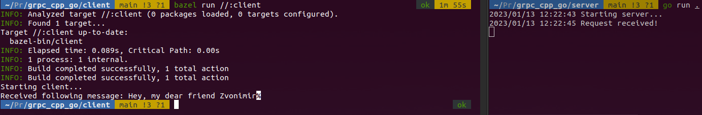

[](https://github.com/zpervan/grpc_cpp_go/actions/workflows/ubuntu_client.yml)
[](https://github.com/zpervan/grpc_cpp_go/actions/workflows/ubuntu_server.yml)

# gRPC with C++ and Go

Template/example repository for gRPC in combination with C++ and Go.
This is mostly experimental - feel free to improve it if you see anything :)

## Currently, tested on Ubuntu 22.04 ##

### Prerequisites ###

- [Bazel 5.4.0](https://github.com/bazelbuild/bazel/releases/download/5.4.0/bazel_5.4.0-linux-x86_64.deb)
- [Go 1.19.4](https://go.dev/dl/go1.19.4.linux-amd64.tar.gz)
- Gcc 11.3.0

### Setup ###

Besides the above-mentioned prerequisites, also install the following dependencies:
```shell
sudo apt install build-essential autoconf libtool pkg-config
```

Install the `protoc` compiler. You can do this in two ways:
1. Download [protoc 21.6](https://github.com/protocolbuffers/protobuf/releases/download/v21.6/protoc-21.6-linux-x86_64.zip), build it then add the built binary (`bin` file) to your `PATH` environment
2. Install with ` sudo apt-get install protobuf-compiler`

I recommend to install it via the first step as the `apt-get` repositories tend to lag behind, but it's up to you. Also, don't forget to generate new proto Go files if you have a different version than 21.6. 

Navigate to the `server` folder and execute the following command:
```shell
go install google.golang.org/protobuf/cmd/protoc-gen-go
go install google.golang.org/grpc/cmd/protoc-gen-go-grpc
```

### Usage ###

Make sure that the generated proto files are located in `server/proto`, if not, position your terminal into `messages` and execute the following command:
```shell
protoc --go_out=../server/proto --go_opt=paths=source_relative --go-grpc_out=../server/proto --go-grpc_opt=paths=source_relative *.proto   
```

Position your terminal at the root of the `server` folder and execute:
```shell
go run .
```

Position your terminal at the root of the `client` folder and execute:
```shell
bazel run //:client
```


Additionally, if you want to test your server without using the client, you can use [BloomRPC](https://github.com/bloomrpc/bloomrpc).

### More examples and advanced gRPC topics ###
- [Cpp gRPC example](https://grpc.io/docs/languages/cpp/quickstart/)
- [Golang with Bazel](https://medium.com/@simontoth/golang-with-bazel-2b5310d4ce48)
- [go-grpc-bazel-docker](https://github.com/salrashid123/go-grpc-bazel-docker)
- [Example basic proto](https://github.com/bazelbuild/rules_go/blob/master/proto/core.rst#example-basic-proto)